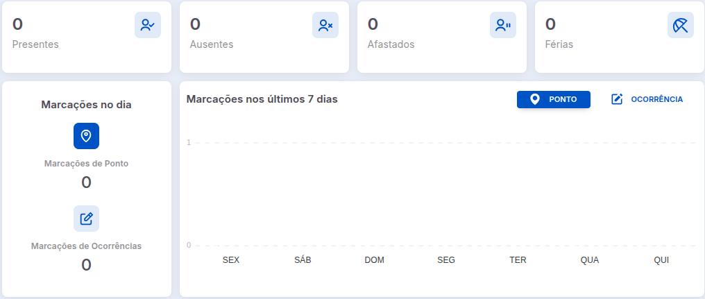

# Dashboard iPonto Web

No dashboard do sistema é possível encontrar diversas informações.

## Informações básicas

Nessa seção é possível encontrar algumas informações relevantes, como:
- Filtro de Unidades de Negócio
- Capacidade do sistema
- Status do contrato

## Métricas de colaboradores

É possível ter um panorama sobre as métricas dos colaboradores, como:

- Colaboradores presentes
- Colaboradores ausentes
- Colaboradores afastados
- Colaboradores em férias
- Marcações do dia
- Histórico de marcações e ocorrências nos últimos 7 dias